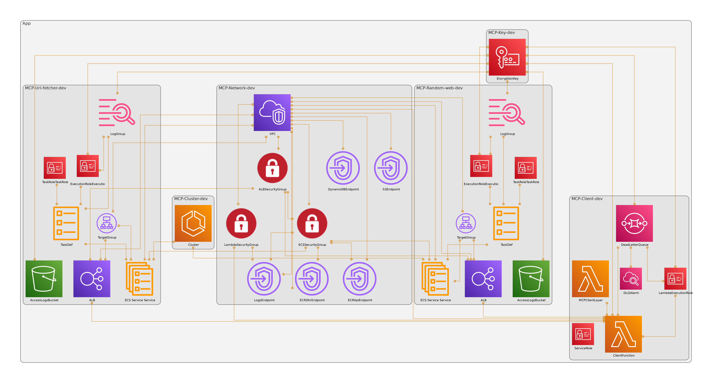

# MCP Cluster for AWS

A modular implementation of Model Completion Protocol (MCP) servers and clients for AWS.

## Features

- Multiple MCP servers with different capabilities
- Modular client for interacting with multiple servers
- Integration with AWS Bedrock
- Docker support for easy deployment
- Lambda layer packaging for serverless deployment
- AWS CDK infrastructure as code

## Project Architecture

Current implementation builds the next services



## Project Structure

```
mcp_cluster_aws/
├── mcp_server/           # Server package
│   ├── __init__.py
│   ├── config.py
│   └── base_server.py
│
├── mcp_client/           # Client package
│   ├── __init__.py
│   ├── server.py
│   ├── bedrock_client.py
│   └── mcp_client.py
│
├── examples/             # Example implementations
│   ├── url_fetcher_server.py
│   ├── roi_calculator_server.py
│   ├── random_web_server.py
│   └── client_example.py
│
├── docker/               # Docker configurations
│   ├── Dockerfile.url-fetcher
│   ├── Dockerfile.roi-calculator
│   └── Dockerfile.random-web
│
├── build_layer_lambda.sh # Script to build Lambda layer
├── build_and_deploy_lambda.sh # Script to build and deploy Lambda
└── cdk/                  # AWS CDK deployment code
```

## Quick Start

### Installation

```bash
# Install uv and set up environment
make setup

# Install dependencies
make install

# For development dependencies
make dev
```

### Running Locally

```bash
# Run individual servers
python examples/url_fetcher_server.py
python examples/roi_calculator_server.py
python examples/random_web_server.py

# Run example client
python examples/client_example.py
```

### Docker Deployment

```bash
# Build Docker images
make docker-build

# Start Docker containers
make docker-up

# Stop Docker containers
make docker-down
```

### AWS Deployment

#### Building Lambda Layer

```bash
# Build Lambda layer. Local Docker require
./build_layer_lambda.sh
```

#### Deploy with CDK

```bash
# Build layer and deploy all at once
./build_and_deploy_lambda.sh

# Or deploy step by step
make cdk-bootstrap  # First time only
make cdk-deploy
```

## Client Usage Example

```python
import asyncio
from mcp_client import MCPClient

async def main():
    client = MCPClient()
    await client.initialize_servers()
    
    # Process a request
    conversation = await client.process_request("Can you give me a url that it has 'example' word in the title?")
    
    # Print the conversation
    for msg in conversation:
        print(f"{msg['role']}: {msg.get('message', '')}")
    
    await client.cleanup()

asyncio.run(main())
```

## Development Commands

```bash
make format         # Format code with black and isort
make clean          # Clean up build artifacts
make build          # Build both packages
make build-client   # Build only the client package
make build-server   # Build only the server package
```

## License

MIT
